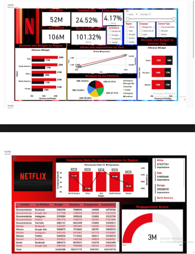

# 🎬 Netflix Marketing Campaign Dashboard

I’m thrilled to share my latest project: the **Netflix Marketing Campaign Dashboard**, built to analyze and visualize key performance metrics across regions, content types, and ad platforms.  

This project demonstrates my expertise in **Power BI, DAX, and Data Modeling** to deliver actionable insights for data-driven marketing decisions.

---

## 🔹 Tools & Technologies
- **Power BI** for advanced visualizations  
- **DAX** for calculated metrics  
- **Data Modeling** for relationship management  

---

## 📊 Dashboard Preview
  

---

## ✨ Key Insights
- **Total Revenue & Budget Analysis** → Clear KPIs showcasing financial performance  
- **Regional Insights** → Breakdown of revenue, budget, and conversion rates by region  
- **Content Type Comparison** → Performance of Series, Documentaries, and Movies  
- **Engagement Metrics** → Conversion rates, impressions, and ROI analysis  
- **Dynamic Filters** → Interactive slicers for Region, Campaigns, and Ad Platforms  
- **Visually Engaging Design** → Netflix-themed colors (Red, Black, White) for brand consistency  

---

## 🚀 Features
- 100% interactive and dynamic dashboard  
- Drill-down capabilities for deeper insights  
- Intuitive filters for region, campaign, and ad platform analysis  
- Engaging, brand-aligned design  

---
